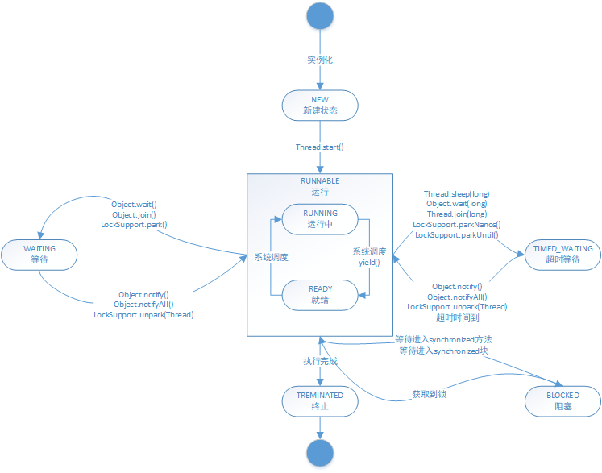
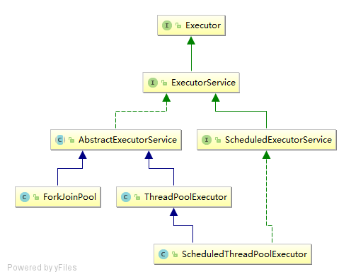

##什么是线程&多线程
 * 线程：进程的一个实体，是CPU调度和分派的基本单位，它是比进程更小的能独立运行的基本单位。自己不拥有系统资源，只拥有一点在运行中必不可少的资源（如程序计数器、一组寄存器和栈），但是可与同属一个进程的其它的线程共享进程所拥有的全部资源 
 * 多线程：单个程序中可以同时运行多个不同的线程执行不同的任务。多线程编程的目的是“最大限度地利用CPU资源”，当某一线程的处理不需要占用CPU而只和IO等资源打交道时，让需要的占用CPU的其他线程有机会获得CPU资源。从根本上说，这就是多线程编程的最大目的。
##线程三种创建方式
 * 实现Runnable接口，使用Thread实例启动，无返回值，异常内部处理
 * 继承Thread接口，无返回值，单继承，不能在线程池在执行。
 * 实现Callable接口，使用FutureTask包装，放入Thread实例中启动，有返回值，可以抛出异常

 ##线程的状态（见Thread类DOC)
 * NEW 新建，初始状态，没有调用start之前
 * RUNNABLE 运行状态，java线程将操作系统中的就绪和运行两种状态笼统地称作“运行中” 
 * WAITING 等待，表示线程进入等待状态，进入该状态表示当前线程需要等待其他线程做出一些特定的动作（通知或中断）
 * TIMED_WAITING 超时等待，该状态不同于WAITING,它是可以在指定的时间内自行返回的
 * BLOCKED 阻塞，表示线程阻塞于锁
 * TERMINATED 终止状态，表示当前线程已经执行完毕
  
 
 ##线程的执行顺序
  * Thread.join() : Waits for this thread to die.
  
 ##ThreadPoolExecutor解析
  * 类继承体系如下
  
  
 
  * 构造方法解析
      
         /**
          * Creates a new {@code ThreadPoolExecutor} with the given initial
          * parameters.
          *
          * @param corePoolSize the number of threads to keep in the pool, even
          *        if they are idle, unless {@code allowCoreThreadTimeOut} is set
          * @param maximumPoolSize the maximum number of threads to allow in the
          *        pool
          * @param keepAliveTime when the number of threads is greater than
          *        the core, this is the maximum time that excess idle threads
          *        will wait for new tasks before terminating.
          * @param unit the time unit for the {@code keepAliveTime} argument
          * @param workQueue the queue to use for holding tasks before they are
          *        executed.  This queue will hold only the {@code Runnable}
          *        tasks submitted by the {@code execute} method.
          * @param threadFactory the factory to use when the executor
          *        creates a new thread
          * @param handler the handler to use when execution is blocked
          *        because the thread bounds and queue capacities are reached
          * @throws IllegalArgumentException if one of the following holds: 
          *         {@code corePoolSize < 0} 
          *         {@code keepAliveTime < 0} 
          *         {@code maximumPoolSize <= 0} 
          *         {@code maximumPoolSize < corePoolSize}
          * @throws NullPointerException if {@code workQueue}
          *         or {@code threadFactory} or {@code handler} is null
          */
         public ThreadPoolExecutor(int corePoolSize,
                                   int maximumPoolSize,
                                   long keepAliveTime,
                                   TimeUnit unit,
                                   BlockingQueue<Runnable> workQueue,
                                   ThreadFactory threadFactory,
                                   RejectedExecutionHandler handler)
                               
   
   
  * 线程池分类  
    普通线程池 ThreadPoolExecutor  
    定时线程池 ScheduledThreadPoolExecutor
  
  * 线程池ThreadPoolExecutor.execute方法执行时序图
  
  * 线程池ThreadPoolExecutor运行思路解析
  
   
  
   
        